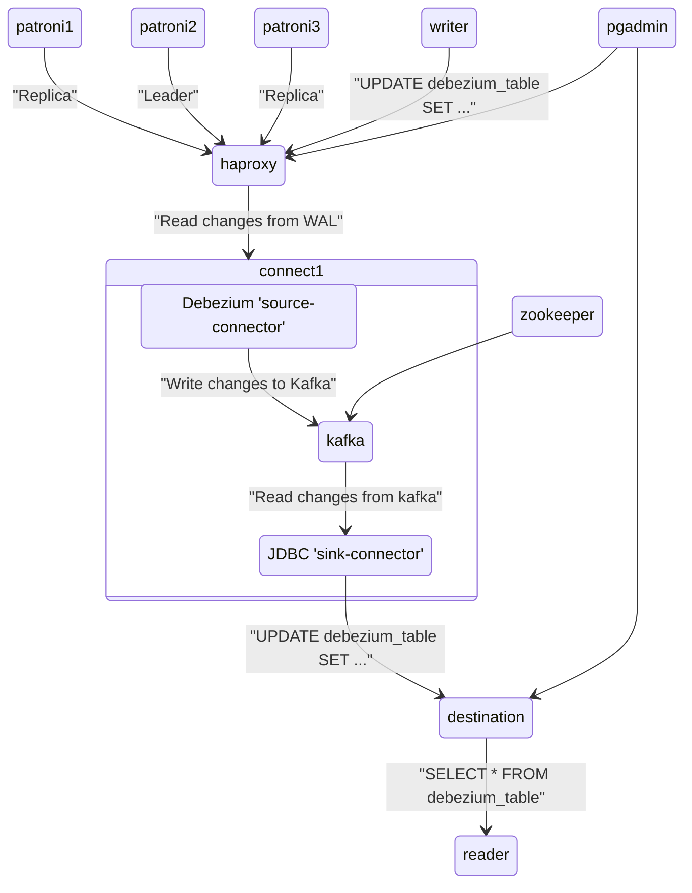

# Пример использования совместного использования patroni и debezium

## Архитектура решения



## Список сервисов

- etcd1 - KV хранилище используемое patroni #1.
- etcd2 - KV хранилище используемое patroni #2.
- etcd3 - KV хранилище используемое patroni #3.
- patroni1 - реплика Postgres.
- patroni2 - текущий лидер в кластере Postgres.
- patroni3 - реплика Postgres.
- haproxy - HAProxy, указывает на текущего лидера Postgres.
- destination - PostgreSQL с БД получателя данных destination_db.
- connect1 - экземпляр kafka-connect #1. Хост для коннекторов Debezium для чтения из source_db и JDBC Sink для записи в destination_db.
- connect2 - экземпляр kafka-connect #2. Хост для коннекторов Debezium для чтения из source_db и JDBC Sink для записи в destination_db.
- kafka - Apache Kafka.
- zookeeper - Apache Zookeper, необходим для kafka.
- writer - .net core приложение, обновляет данные в БД источнике source_db.
- reader - .net core приложение, читает данные из БД получателя destination_db.
- pgadmin

## Список файлов и директорий
1. `delete-connector.sh` - удаляет коннектор
2. `kafka-console-consumer.sh` - считывает сообщения из указанного топика
3. `kafka-topics.sh` - список топиков kafka
4. `kill.sh` - убивает контейнер
5. `list-connectors.sh` - возвращает список коннеторов
6. `patronictl.sh` - выполняет команды patronictl, см. https://bootvar.com/useful-patroni-commands/
7. `register-postgres.json` - конфигурация коннетора debezium для postgres
8. `register-postgres.sh` - регистрирует коннектор debezium для postgres
9. `register-sink.json` - конфигурация коннектора JDBC для postgres
10. `register-sink.sh` - регистрирует JDBC коннетор
11. `restart-connectors.sh` - перезапускает задачу коннектора
12. `resume-connectors.sh` - перезапускает коннектор
13. `setup_cluster.sh` - скрипт настройки source_db в кластере postgres
14. `setup_destination.sql` - скрипт настройки destination_db
15. `start-writer.sh` - запускает контейнер который обновляет данные в source_db
16. `stop-writer.sh` - останавливает контейнер который обновляет данные в source_db
17. `/app` - .net core приложения writer и reader
18. `/connect` - параметры логирования для kafka-connect
19. `/debezium-jdbc` - Dockerfile для kafka-connect с debezium и JDBC коннектором 
20. `/pgAdmin` - настройки подключений для pgAdmin
21. остальные файлы из patroni и пердназначены для сборки образа patroni, но docker на windows не может собрать работающий образ см. https://github.com/zalando/patroni/issues/1841. Поэтому в docker-compose используется образ andrushin/patroni.

## Конфигурация replication slots в patroni
См. файл postgres0.yml
```yaml
    parameters:
      wal_level: logical    

    slots:
      source_slot:
        type: logical
        database: source_db
        plugin: pgoutput
```
и файл конфигурации debezium коннектора `register-postgres.json`.
```json
 "config": {
    ...
    "slot.name": "source_slot",
    ...
}
```
Тут создается и указывается repication slot который patroni создаст после запуска кластера postgres на лидере и репликах. К которому позже подключится debezium. См. статью https://www.percona.com/blog/how-patroni-addresses-the-problem-of-the-logical-replication-slot-failover-in-a-postgresql-cluster/

## Запуск

1. Запуск docker-compose 
    ```shell
    docker compose up
    ```
2. После запуска сервисов, остановить `writer`
    ```shell
    ./stop-writer.sh
    ```
3. Публикуем Debezium source-connector
    ```shell
    ./register-postgres.sh
    ```
4. Публикуем Debezium sink-connector
    ```shell
    ./register-sink.sh
    ```
5. Убедиться что все коннекторы запущены и находятся в состоянии RUNNING
    ```shell
    ./list-connectors.sh
    ```
6. Запускаем `writer`
    ```shell
    ./start-writer.sh
    ```
7. После чего можно перейти в pgadmin по адресу http://localhost:5050/ и там в группе debezium_test будет два сервера `haproxy` и `destination`.
8. Выполнить запрос на `source_db` чтобы убедиться что `writer` записал данные
    ```sql
    SELECT * FROM debezium_table;
    ```
9. Выполнить запрос на `destination_db` чтобы убедиться что данные переданы через `kafka`
    ```sql
    SELECT * FROM debezium_table;
    ```

## Инициализация БД источника (source_db) и потребителя (destination_db)
1. После того как кластер Postgres будет сформирован patroni запускает post_bootstrap скрипт `setup_cluster.sh` для инициализации `source_db`. См. файл `postgres0.yml`
    ```yaml
      # Additional script to be launched after initial cluster creation (will be passed the connection URL as parameter)
      post_init: /usr/local/bin/setup_cluster.sh
    ```
и файл `docker-compose.yml`
```yaml
volumes: &post_init
  - type: bind
    source: ./setup_cluster.sh
    target: /usr/local/bin/setup_cluster.sh
  - type: bind
    source: ./postgres0.yml
    target: /home/postgres/postgres0.yml
```
2. Для инициализации БД получателя после того как стартовал Postgres контейнер `destination` выполняется скрипт `setup_destination.sql`. См. файл `docker-compose.yml`
    ```yaml
    volumes:
      - type: bind
        source: ./setup_destination.sql
        target: /docker-entrypoint-initdb.d/setup_destination.sql
    ```
## Смена лидера Postgres через patronictl (Switchover)
1. Получить список экземпляров Postgres и определить какой из них является лидером
    ```shell
    ./patronictl.sh list
    ```
2. Сменить лидера кластера Postgres
    ```shell
    ./patronictl.sh switchover
    ```

## Тестирование Failover
1. Получить текущего лидера кластера Postgres, в колонке Role будет указано Leader
    ```shell
    ./patronictl.sh list
    ```
2. Убить процесс в контейнере docker
    ```shell
    ./kill.sh patroni1
    ```

## Тестирование ребаланса в кластере kafka-connect
1. Определить в каком экземпляре живет коннектор
    ```shell
    ./list-connectors.sh
    ```
2. Убить процесс в контейнере docker. Команда docker stop для этого не подходит потому что при graceful shutdown коннекторы перейдут в состояние UNASSIGNED и будут находится в нем до тех пор пока не поднимется остановленный экземпляр kafka-connect или их принудительно не запустят. См. команду `resume-connector.sh`.
    ```shell
    ./kill.sh connect1
    ```
3. Убедиться что все коннеторы продолжили работу на оставшемся экземпляре kafka-connect
    ```shell
    ./list-connectors.sh
    ```

## Тестирование outbox паттерна
1. Добавить переменную окружения OUTBOX для контейнера `writer`, после чего он начнет вставлять сообщения в таблицу `public.outbox`
    ```yaml
    writer:
        image: writer
        environment:
          OUTBOX: "true"
    ```
2. Создать outbox коннектор
    ```shell
    ./register-outbox.sh
    ```
3. Прочитать события из топика `Person.events`
    ```shell
    ./kafka-console-consumer.sh Person.events
    ```

